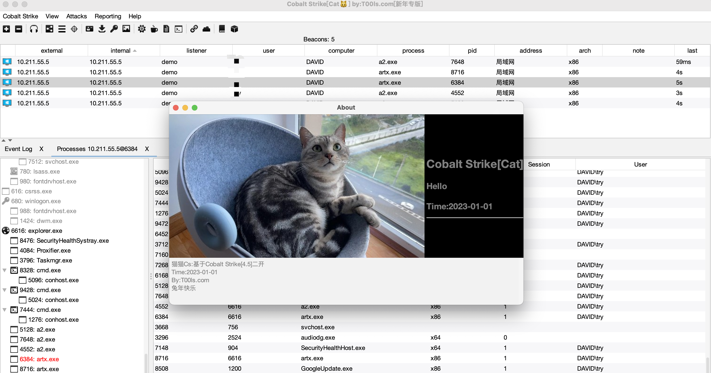
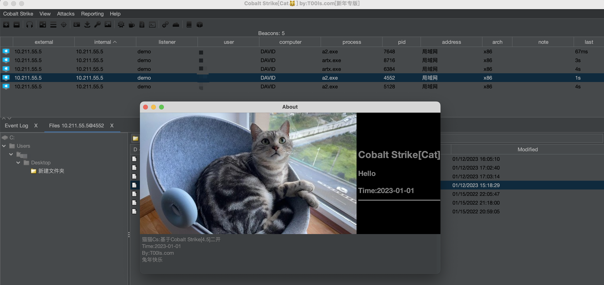

# 2023-05-01 更新最终版，以后将不再更新.
## 更新说明[更新说明](https://github.com/TryGOTry/CobaltStrike_Cat_4.5/blob/main/README_END.md)

# CobaltStrike-[Cat]-4.5-兔年快乐

> Ps:猫猫🐱Cs:基于CobaltStrike4.5二开完成 (原dogcs4.4二开功能基本都有)(自带破解,不需要使用csagent.)
>
> 自定义属于你自己的CobaltStrike,方便一些不会二开的朋友使用～本人只测试了https上线,如有bug请在lssues中提出.
>
> By: T00ls.com

## 相关配置

`Java版本:11 运行前请先配置CatClient.properties`

#### 客户端

> **右边👉下载的自带java11环境,直接运行runcatcs.vbs即可(仅限windows),其他系统执行:java -jar cat_client.jar client**

##### 配置文件说明(CatClient.properties)

|        配置名        |                           配置说明                           |
| :------------------: | :----------------------------------------------------------: |
|  CatClient.Version   | 自定义版本号,需要和服务端一致.(别人拿到这个版本的cs信息,如果版本号不对,也无法登录TeamSever):String |
|  CatClient.OpenAuth  | 是否开启auth验证,需要和服务端对应(开启后安全性较高,但是客户端无法断线重连)：true,false |
| CatClient.InjectSelf | 是否注入自身,开启的话Desktop，Keylogger,Hashdump,PortScan,Mimikatz,PowerShellUnmanaged,Printscreen,Screenshot,Screenwatch会注入自身(开启后无法适配geacon_pro)：true,false |
|   CatClient.theme    |            客户端主题配置,0是原版,1是白色,2是黑色            |
|  CatClient.ini_name  |            自定义配置文件存放名称,防止被蜜罐读取             |
| stager.checksum-num  |     关于stager的相关配置(强烈建议用profile文件自定义url)     |
|    stager.x86-num    |                     客户端和服务器需一致                     |
|  stager.x86-uri-len  |                     客户端和服务器需一致                     |
|    stager.x64-num    |                     客户端和服务器需一致                     |
|  stager.x64-uri-len  |                     客户端和服务器需一致                     |

##### 相关截图

> 白色主题



> 暗黑主题



> 版本不对错误提示


---

#### 服务端

```bash
推荐使用ubuntu18运行
sudo apt install openjdk-11-jre-headless
sudo apt install openjdk-11-jdk
```

> **需Java11运行，运行前请先配置CatServer.properties**

##### 配置文件说明(CatServer.properties)

|          配置名          |                           配置说明                           |
| :----------------------: | :----------------------------------------------------------: |
|    CatServer.Version     | 自定义版本号,需要和客户端一致.(别人拿到这个版本的cs信息,如果版本号不对,也无法登录TeamSever)，可以是任意字符串 |
|      CatServer.port      |                          服务端端口                          |
|     CatServer.store      |               TeamServer证书文件(需放当前目录)               |
| CatServer.store-password |                           证书密码                           |
|      CatServer.host      |    服务器ip(可随意填写,只是客户端监听时候会默认显示的ip)     |
|    CatServer.password    |                          服务端密码                          |
|  CatServer.profile-name  |                       profile文件名称                        |
|    CatServer.profile     | 使用的profile文件,需放在当前目录下(所以必须使用profile启动)  |
|      CatServer.auth      |         是否开启双重验证,需要和客户端一致:true,false         |
|    CatServer.authlog     | 是否开启登录日志记录(只是在安全码正确,但是密码错误的情况下记录.):true,false |
|   CatServer.googleauth   |          开启双重验证后,再开启谷歌验证码:true,false          |
|   CatServer.googlekey    | 谷歌二次验证的key(可用java -jar cat_server.jar google 命令生成) |
|    CatServer.safecode    | 如果开启双重验证,但是关闭谷歌的话,就会启动安全码,固定不变(限制10位数) |
|       CatServer.Iv       | AES加密的iv值,方便类似geacon_pro等重写的项目，限制为16位,切勿乱改,会出现无法上线问题(默认:abcdefghijklmnop) |
|   stager.checksum-num    |     关于stager的相关配置(强烈建议用profile文件自定义url)     |
|      stager.x86-num      |                     客户端和服务器需一致                     |
|    stager.x86-uri-len    |                     客户端和服务器需一致                     |
|      stager.x64-num      |                     客户端和服务器需一致                     |
|    stager.x64-uri-len    |                     客户端和服务器需一致                     |

##### 相关命令

```bash
运行服务端:
chmod 755 teamserver
./teamserver

Windows下运行(改好配置文件后)
java.exe -jar cat_server.jar server

获取google二次验证配置:
java -jar cat_server.jar google
（Ps:将获取到的SecretKey填入服务端配置中,把data:image/jpeg;base64...这一串复制到浏览器中打开,用谷歌验证器扫描）

运行cna脚本

(如果没开启二次验证)
java -jar cat_server.jar script [host] [port] [user] [password] [cna脚本]

(如果开启二次验证)
java -jar cat_server.jar script [host] [port] [user] [password] [二次验证的密码] [cna脚本]
```

# 一些二开说明

1. 去除ListenerConfig中的特征水印

2. 修改Stager Url（checksum8）校验算法

3. 修改默认登录int长度48879,让网上的爆破脚本无法爆破

4. 修改beacon配置信息的默认密钥,不会被默认的脚本获取到配置信息

5. 增加在线主机统计

6. 自定义bypass 360核晶模式:截图,Mimikatz,Hashdump等

7. 去掉遗留的暗桩bug

8. 可自定义修改默认配置文件存放文件名

9. 新加ip归宿地查询

10. 自定义双端版本号

    -------------------------------------------------------------

## 关于CVE-2022-39197

没找到好的解决方法,直接用这个哥们的patch补丁即可:https://github.com/burpheart/CVE-2022-39197-patch

### 关于密码

解压密码放在T00ls.com中.

https://www.nctry.com/
