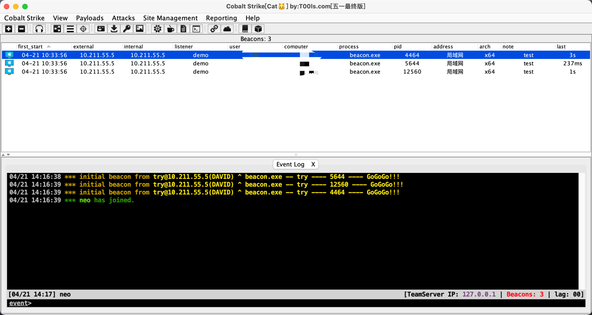
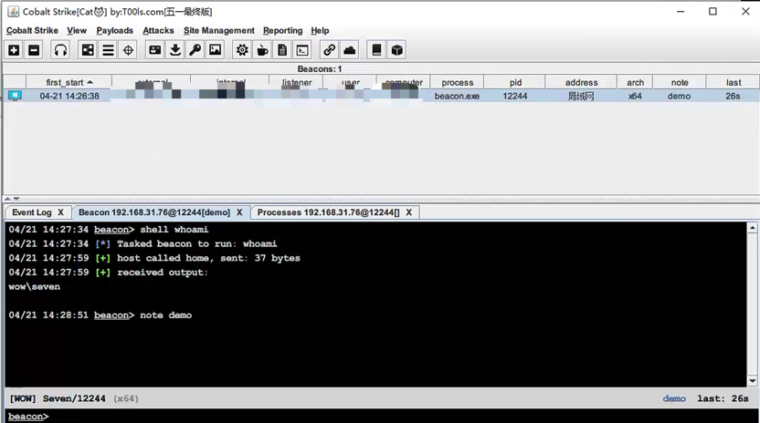
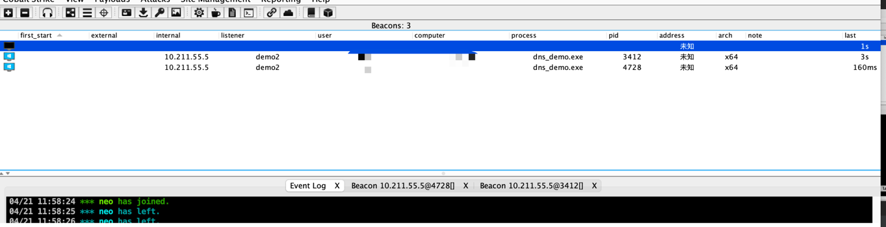
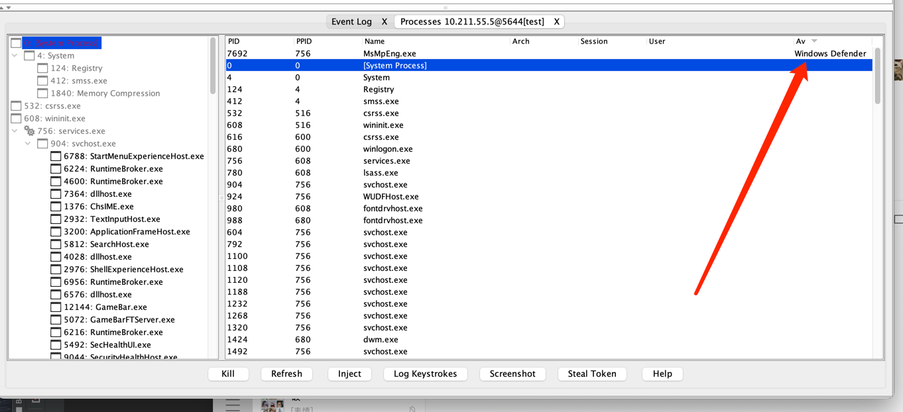

# catcs五一版更新日志

## 说明

---
这将是cat系列最后一个版本,由于本人精力不够,决定以后不会再更新.

如有重大bug的话,可以维护.

有分享才有进步,希望大家不要藏着掖着,多多分享,互相学习,互相进步🙏。

---
## 2023.05.01
1. 服务端上线信息存入db数据库,可以勉强实现主机备注不消失(有些bug,因为无法准确判断主机唯一值)ps:如果进程名,用户名,主机名,监听器名相同的话.就会判断相同主机.
2. 修复主题为0时ui不兼容的bug
3. ui方面的功能栏直接使用的4.7的
4. 兼容crossC2上线的ui显示(pid显示)
5. 主机信息表格居中
6. 修复若干bug
7. 增加获取进程列表时候自动对比杀软
8. 根据个人习惯优化了一下ui,如配置文件默认开启记录命令执行时候的时间,文件管理标签自带备注等.
9. 修复dns上线时候客户端崩溃问题
10. 列表按照第一次上线信息排序
11. 新增经典上线语音提醒
## 截图
**mac界面**

**Windows界面**

**dns上线**

**进程列表杀软对比**

